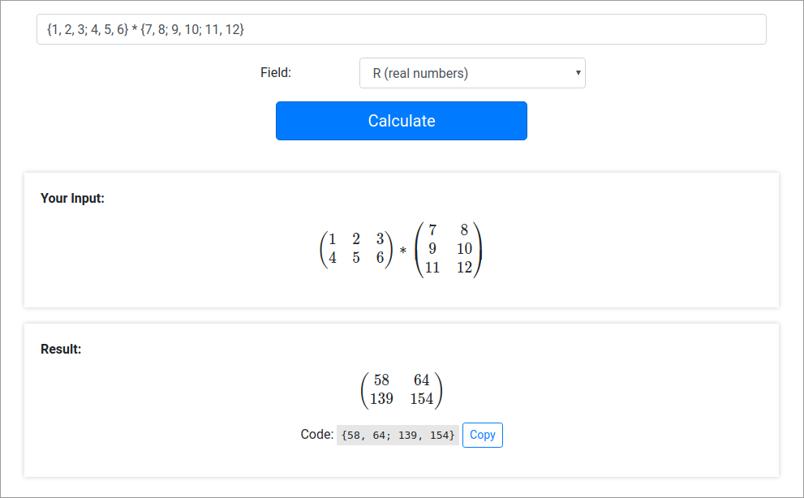
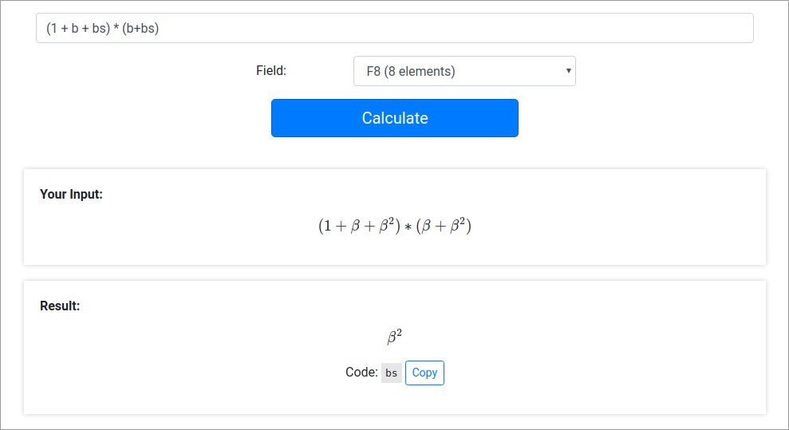

# Matrixer
### An online calculator with support for finite fields and linear algebra

**Website: [matrixer.davidaugustat.com](https://matrixer.davidaugustat.com/)**

## Screenshots
Solving a homogeneous equation system in F9:

Multiplying two matrices:

Doing calculations in F8:

## Functionality
**All functions work with real numbers and on the finite fields F2, F3, F4, F5, F7, F8, F9, F11, F13, F17 and F19.**

- Doing **basic math** (addition, subtraction, multiplication, division, exponentiation) with numbers
- Calculating the **multiplicative inverse** of a number or invertible matrix
- Calculating the **additive inverse** of a number
- **Multiplication, addition and subtraction of matrices**
- **Transposing** matrices
- **Multiplication of matrices by vectors**
- **Multiplication, addition and subtraction of vectors**
- Solving **homogeneous equation systems**
- Converting a matrix to 
**[reduced row echelon form](https://en.wikipedia.org/wiki/Row_echelon_form#Reduced_row_echelon_form)**

Details and instructions for all described functions can be found on the 
[website of this project](https://matrixer.davidaugustat.com/).

## Structure of the code
I wrote the entire math engine used by this calculator in JavaScript. The application is completely front end, 
meaning that all calculations are executed in the user's web browser.

Here you can find the different parts of the project:

- **Mathematical code:** [source/mathEngine/math](source/mathEngine/math): 
All the code that does the mathematical calculations in the background
- **String interpretation:** [source/mathEngine/stringInterpretation](source/mathEngine/stringInterpretation): 
Code that validates and interprets the user input and converts it into a binary tree used for the calculations
- **HTML code:** [source/html](source/html): The layout and design of the website
- **Assets** (CSS, images, ...): [source/assets](source/assets)

This project uses [Webpack](https://webpack.js.org/) to bundle all the individual files in the source folder into a
 small number of output files, which are then saved in the distribution folder. The output files are however not
  included in this git repository. You can easily compile them yourself using NPM and Webpack.

## Building the output files yourself
For the following steps you need to have [NPM](https://www.npmjs.com/) installed already. For those that haven't yet: 
There are plenty of tutorials on that online.

1. Run `git clone https://github.com/davidaugustat/matrixer.git` to clone the repository.
2. Run `cd matrixer` to go to the project directory.
3. Run `npm install` to automatically install all dependencies.
4. Set the webpack.config.js file to production mode (this reduces output file size) by **un**commenting the line 
`mode: "production",` and commenting out the lines `mode: "development",` and `devtool: 'inline-source-map',` below.
5. Run `npm run build` to build the output. You can find all output files in the "distribution" folder.

The files in "distribution" can then directly be uploaded to a web server, and you're done.

## Firing up a web server
You can also fire up a local web server using the [webpack-dev-server](https://github.com/webpack/webpack-dev-server) tool. Just clone this repository and run `npm install` to install the dependencies. Then run `npm start` and a web server serving Matrixer will be launched at port 8080 of your machine.

## License
This project is licensed under the GNU General Public License, Version 3. You can find the license [here](LICENSE.txt).
