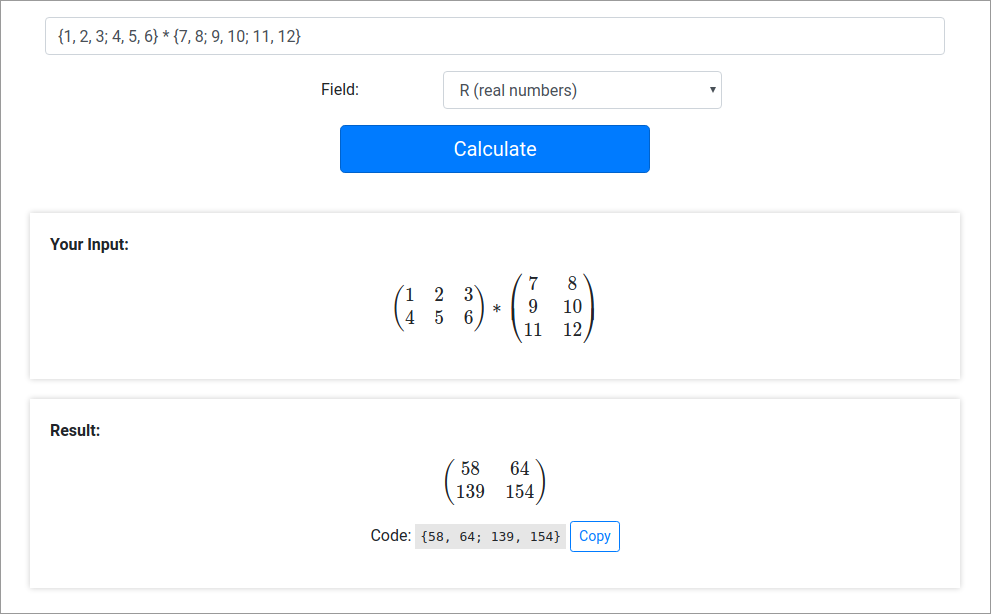
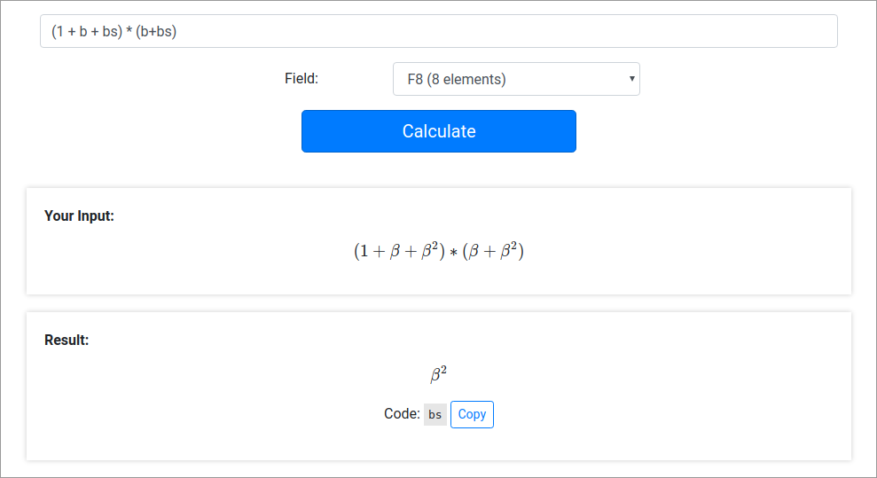

# Matrixer
### An online calculator with support for finite fields and linear algebra

**Website: [matrixer.davidaugustat.com](https://matrixer.davidaugustat.com/)**

## Screenshots
Solving a homogeneous equation system in F9:


Multiplying two matrices:



Doing calculations in F8:



## Functionality
**All functions work with real numbers and on the finite fields F2, F3, F4, F5, F7, F8, F9, F11, F13, F17 and F19.**

- Doing **basic math** (addition, subtraction, multiplication, division, exponentiation) with numbers
- Calculating the **multiplicative inverse** of a number or invertible matrix
- Calculating the **additive inverse** of a number
- **Multiplication, addition and subtraction of matrices**
- **Transposing** matrices
- **Multiplication of matrices by vectors**
- **Multiplication, addition and subtraction of vectors**
- Solving **homogeneous equation systems**
- Converting a matrix to 
**[reduced row echelon form](https://en.wikipedia.org/wiki/Row_echelon_form#Reduced_row_echelon_form)**
- Calculating the **determinant** of a matrix

Details and instructions for all described functions can be found on the 
[website of this project](https://matrixer.davidaugustat.com/).

## Structure of the code
I wrote the entire math engine used by this calculator in JavaScript. The application is completely front end, 
meaning that all calculations are executed in the user's web browser.

Here you can find the different parts of the project:

- **Mathematical code:** [source/mathEngine/math](source/mathEngine/math): 
All the code that does the mathematical calculations in the background
- **String interpretation:** [source/mathEngine/stringInterpretation](source/mathEngine/stringInterpretation): 
Code that validates and interprets the user input and converts it into a binary tree used for the calculations
- **Nuxt application:** [app](app): Vue components, localized pages, router/calculator composables, browser plugins,
UI utilities and processed CSS
- **Public assets:** [public](public): Images and favicons copied into the static output
- **Shared configuration:** [shared](shared): Public route metadata reused by generation, sitemap output and tests
- **Automated tests:** [tests](tests): Vitest math-engine regressions and Playwright tests for the generated website

This project uses [Nuxt](https://nuxt.com/) with Vue and Vite. All six public routes are pre-rendered during the
build and saved in the `distribution` folder. The generated site only contains static HTML, JavaScript, CSS and
assets; no server-side runtime is required after deployment. The output files are not included in this repository.

## Building the output files yourself
The build requires Node.js 24.15 or newer within the 24.x line, plus [NPM](https://www.npmjs.com/).

1. Run `git clone https://github.com/davidaugustat/matrixer.git` to clone the repository.
2. Run `cd matrixer` to go to the project directory.
3. Run `npm install` to automatically install all dependencies.
4. Run `npm run build` to generate the static site. You can find all output files in the `distribution` folder.

The files in "distribution" can then directly be uploaded to a web server, and you're done.

## Firing up a web server
Run `npm run dev` to start the Nuxt development server. After generating the static site with `npm run build`, use
`npm run preview` to preview the production output locally.

## Test Suite
There are logic tests for the math engine and Playwright tests for the web interface.

Install the project dependencies and the Chromium test browser once:

```shell
npm install
npx playwright install chromium
```

Then the following commands are available:

- `npm run lint` checks JavaScript and Vue files with ESLint and validates JSDoc.
- `npm run test:logic` runs the math-engine regression suite with Vitest.
- `npm run test:coverage` runs the math-engine suite and writes text, HTML and JSON coverage reports to `coverage`.
- `npm run build && npm run test:e2e` runs the Playwright browser tests.
- `npm test` runs the logic tests, generates the site, and runs the browser tests in sequence.

## License
This project is licensed under the GNU General Public License, Version 3. You can find the license [here](LICENSE.txt).
